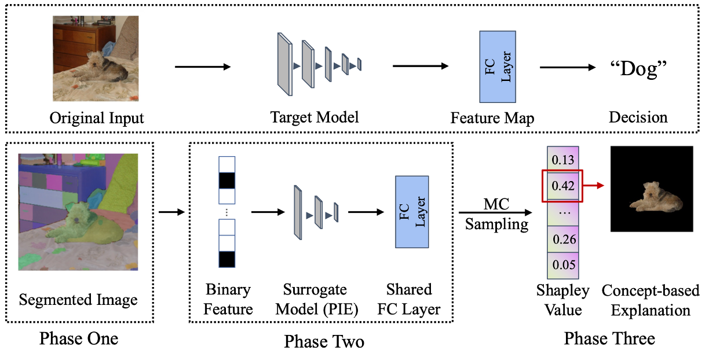
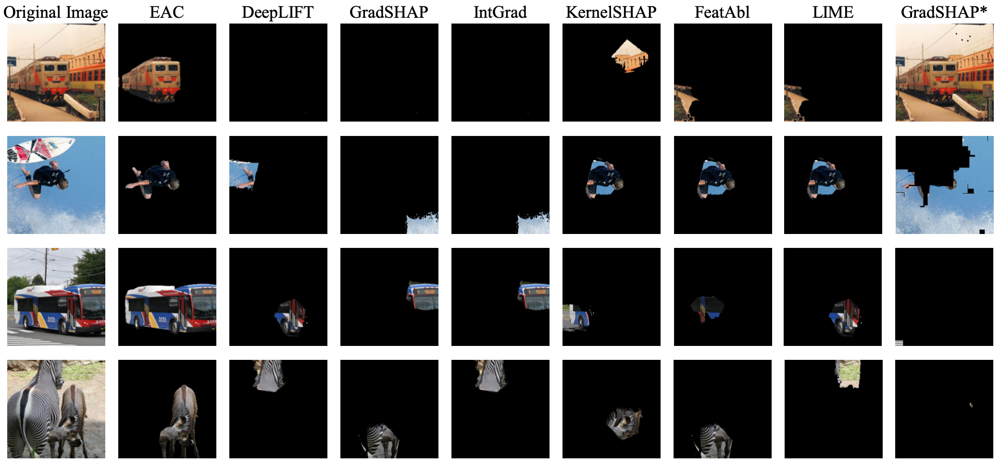

# Explain Any Concept: Segment Anything Meets Concept-Based Explanation (EAC) Poster @ NeurIPS 2023
Code for the paper "Explain Any Concept: Segment Anything Meets Concept-Based Explanation".

## Citation
Please cite the paper as follows if you use the data or code from Samshap:
```
@inproceedings{
sun2023explain,
title={Explain Any Concept: Segment Anything Meets Concept-Based Explanation},
author={Ao Sun and Pingchuan Ma and Yuanyuan Yuan and Shuai Wang},
booktitle={Thirty-seventh Conference on Neural Information Processing Systems},
year={2023},
url={https://openreview.net/forum?id=X6TBBsz9qi}
}
```
## Contact
Please reach out to us if you have any questions or suggestions. You can send an email to asunac@connect.ust.hk.

## Overview
Here is an overview of our work, and you can find more in our [Paper](https://openreview.net/forum?id=X6TBBsz9qi).


Our EAC approach generates high accurate and human-understandable post-hoc explanations.


## Downloading the SAM backbone
We use ViT-H as our default SAM model. For downloading the pre-train model and installation dependencies, please refer [SAM repo](https://github.com/facebookresearch/segment-anything#model-checkpoints).

## Explain a hummingbird on your local pre-trained ResNet-50!
Simply run the following command:
```
python demo_samshap.py
```
